<div align="center">
 

 
<a href="https://git.io/typing-svg">

</a>
 
<br>
 


 
<br>
 
<a href="https://github.com/tiosoaress?tab=repositories">

</a>
<a href="https://www.linkedin.com/search/results/people/?keywords=Isaac%20Soares">

</a>
<a href="mailto:isaac.soares@rpeotta.com.br">

</a>
<a href="https://github.com/tiosoaress">

</a>
 
<br><br>
 

 
<a href="https://github.com/tiosoaress?tab=followers">

</a>
 
<a href="https://github.com/tiosoaress?tab=repositories&sort=stargazers">

</a>
 
</div>
 
---
 
## About
 
I am a **Full-Stack Developer and Computer Science student** focused on designing, building, and evolving software that solves real operational problems.
 
My work is centered on **software engineering, internal platforms, workflow automation, data-driven systems, and product development**. I approach engineering beyond individual features: understanding the business process, designing the architecture, implementing the solution, and continuously improving the final product.
 
I build full-stack applications with strong attention to **system architecture, backend engineering, relational databases, frontend experience, permissions, integrations, automation, performance, and maintainability**.
 
I am also actively exploring **Artificial Intelligence, Large Language Models, local AI infrastructure, AI-assisted development, and intelligent product experiences**, with a focus on integrating AI into practical software rather than treating it as an isolated experiment.
 
My engineering mindset combines:
 
* **Software Engineering** — maintainable architecture, structured codebases, and reliable systems.
* **Full-Stack Development** — complete product delivery across frontend, backend, databases, and infrastructure.
* **Product Engineering** — translating business workflows into useful and intuitive digital products.
* **AI Engineering** — exploring LLM-powered features, intelligent workflows, local models, and developer tooling.
* **Automation** — reducing repetitive processes and connecting systems through efficient workflows.
 
### Open To
 
`Software Engineering` · `Full-Stack Development` · `Product Engineering` · `AI Engineering` · `Open Source Collaboration`
 
---
 
## Tech Stack
 
### Languages
 
<p align="left">

</p>
 
### Frontend
 
<p align="left">

</p>
 
### Backend & Databases
 
<p align="left">

</p>
 
<p align="left">
 


 
</p>
 
### Cloud, DevOps & Tooling
 
<p align="left">

</p>
 
<p align="left">
 


 
</p>
 
---
 
## AI / ML Expertise
 
| Domain                          | Proficiency | Details                                                                                                                       |
| :------------------------------ | :---------: | :---------------------------------------------------------------------------------------------------------------------------- |
| **LLM Application Engineering** |   Applied   | Exploring the integration of language models into practical software products, workflows, and developer experiences.          |
| **Prompt Engineering**          |   Applied   | Designing structured instructions, contextual workflows, and reusable prompt systems for software development and automation. |
| **Local LLM Infrastructure**    |  Exploring  | Researching open-source models, local inference, hardware requirements, deployment strategies, and private AI environments.   |
| **AI-Assisted Development**     |    Active   | Applying AI throughout architecture, implementation, debugging, documentation, and product iteration workflows.               |
| **RAG & Knowledge Systems**     |  Developing | Studying retrieval-driven AI architectures for internal information, documents, and contextual assistants.                    |
| **AI Product Engineering**      |    Active   | Focusing on AI as a product capability integrated into real user flows instead of isolated demonstrations.                    |
 
---
 
## Featured Projects
 
<details>
<summary><b>Portal Dev — Centralized Engineering Operations Platform</b></summary>
 
<br>
 
A centralized internal engineering platform designed to consolidate developer operations, system visibility, user access management, roles, permissions, and technical workflows.
 
| Metric          | Details                                                                       |
| :-------------- | :---------------------------------------------------------------------------- |
| **Stack**       | JavaScript · Python · SQL Server · REST APIs                                  |
| **Scale**       | Multi-system internal engineering environment                                 |
| **Performance** | Centralized access to operational and platform data                           |
| **Security**    | Role-based access control and permission management                           |
| **Impact**      | Reduces fragmented engineering processes and centralizes technical governance |
| **Repository**  | Private / Internal                                                            |
 
The project follows a platform-engineering approach: instead of maintaining permissions, operational tools, and engineering processes across disconnected systems, the goal is to provide a structured internal environment where developers can manage and monitor essential resources from a single place.
 
</details>
 
<br>
 
<details>
<summary><b>RPTools — Internal Developer Productivity Platform</b></summary>
 
<br>
 
An engineering productivity system created to centralize internal tools, operational utilities, automated jobs, system actions, and recurring developer workflows.
 
| Metric          | Details                                                     |
| :-------------- | :---------------------------------------------------------- |
| **Stack**       | Full-Stack Web · Python · JavaScript · SQL                  |
| **Scale**       | Internal tooling ecosystem                                  |
| **Performance** | Faster access to repetitive engineering operations          |
| **Security**    | Controlled access to internal actions and resources         |
| **Impact**      | Reduces manual work and standardizes development operations |
| **Repository**  | Private / Internal                                          |
 
RPTools is designed around a simple principle: repetitive technical work should become a productized workflow.
 
The platform organizes engineering utilities into a structured environment with clear actions, readable descriptions, controlled permissions, and reusable automation.
 
</details>
 
<br>
 
<details>
<summary><b>Lume Atelier — Decorative Lighting Business Platform</b></summary>
 
<br>
 
A complete digital platform for a decorative lighting company, combining a public commercial experience with an internal operational management system.
 
| Metric          | Details                                                                          |
| :-------------- | :------------------------------------------------------------------------------- |
| **Stack**       | Full-Stack Web · Modern UI · Workflow Management                                 |
| **Scale**       | Public website and internal business platform                                    |
| **Performance** | Unified commercial and operational workflow                                      |
| **Security**    | Separated public and authenticated internal experiences                          |
| **Impact**      | Centralizes quotations, proposals, contracts, scheduling, and project operations |
| **Repository**  | Private Project                                                                  |
 
The platform connects the complete business journey: company presentation, portfolio, client contact, quotation requests, proposal creation, PDF export, contract management, project workflow, and scheduling.
 
The product is designed to eliminate information fragmentation across spreadsheets, messages, documents, and disconnected tools.
 
</details>
 
<br>
 
<details>
<summary><b>Timesheet Intelligence — Operational Data & Reporting Workflow</b></summary>
 
<br>
 
A data-oriented workflow for analyzing time records, project allocation, employee activity, missing submissions, and management reporting.
 
| Metric          | Details                                                   |
| :-------------- | :-------------------------------------------------------- |
| **Stack**       | SQL Server · Python · Excel Automation · Data Processing  |
| **Scale**       | Employee, project, and monthly reporting datasets         |
| **Performance** | Automated consolidation of operational records            |
| **Security**    | Internal business data processing                         |
| **Impact**      | Reduces manual analysis and improves reporting visibility |
| **Repository**  | Private / Internal                                        |
 
The workflow transforms raw timesheet records into structured management outputs, including employee summaries, project-level breakdowns, missing-record detection, monthly analysis, expandable reports, and professionally formatted spreadsheet exports.
 
</details>
 
---
 
## Experience
 
### Full-Stack Developer — RPEOTTA
 
`Present`
 
Developing and evolving internal software platforms focused on business operations, engineering productivity, project workflows, people processes, access management, reporting, and automation.
 
#### Scope of Work
 
* Build full-stack systems from business requirements through production implementation.
* Design internal platforms that replace fragmented spreadsheets, documents, and manual workflows.
* Develop backend services, REST APIs, relational database queries, and system integrations.
* Work extensively with SQL Server for operational analysis, application data, reporting, and business workflows.
* Design authentication, roles, permissions, and centralized access-management experiences.
* Create dashboards, notifications, exports, reporting flows, and real-time application features.
* Translate complex internal processes into structured and intuitive product experiences.
* Improve legacy workflows through refactoring, centralization, automation, and better system architecture.
* Collaborate with stakeholders to convert operational requirements into scalable software solutions.
 
<p align="left">
 


 
</p>
 
---
 
## Achievements
 
<div align="center">
 
| Recognition                        | Details                                                                                                             |
| :--------------------------------- | :------------------------------------------------------------------------------------------------------------------ |
| **End-to-End Product Engineering** | Designs solutions across requirements, architecture, frontend, backend, database, workflows, and delivery.          |
| **Internal Platform Development**  | Builds systems focused on centralizing operational processes and reducing fragmented workflows.                     |
| **Workflow Automation**            | Converts repetitive technical and business processes into structured digital workflows.                             |
| **Data-Driven Engineering**        | Uses operational data, SQL analysis, reporting, and automation to improve visibility and decision-making.           |
| **Continuous Product Improvement** | Iterates on usability, architecture, permissions, performance, and maintainability based on real operational needs. |
 
</div>
 
---
 
## Certifications
 
### AWS
 
<p align="left">
<a href="https://aws.amazon.com/training/">

</a>
</p>
 
### Oracle
 
<p align="left">
<a href="https://education.oracle.com/">

</a>
</p>
 
### NPTEL
 
<p align="left">
<a href="https://nptel.ac.in/">

</a>
</p>
 
### Cisco
 
<p align="left">
<a href="https://www.netacad.com/">

</a>
</p>
 
---
 
## Coding Profiles
 
<div align="center">
 
<a href="https://leetcode.com/">

</a>
<a href="https://www.geeksforgeeks.org/">

</a>
<a href="https://www.hackerrank.com/">

</a>
<a href="https://www.codechef.com/">

</a>
 
</div>
 
---
 
## GitHub Analytics
 
<div align="center">
 

 

 
<br><br>
 

 
</div>
 
---
 
## 🔗 GitHub Trophies
 
<div align="center">
 

 
</div>
 
---
 
## Contribution Activity
 
<div align="center">
 

 
</div>
 
---
 
## Contribution Snake
 
<div align="center">
 
<picture>
<source
    media="(prefers-color-scheme: dark)"
    srcset="./dist/github-snake-dark.svg"
>
<source
    media="(prefers-color-scheme: light)"
    srcset="./dist/github-snake.svg"
>

</picture>
 
</div>
 
---
 
## Current Focus
 
```yaml
learning:
  - Advanced Software Architecture
  - Artificial Intelligence and Large Language Models
  - Local LLM Infrastructure
  - Scalable Backend Engineering
  - Cloud and DevOps Practices
 
building:
  - Internal Engineering Platforms
  - Workflow Automation Systems
  - Full-Stack Business Applications
  - Data-Driven Operational Tools
  - AI-Enhanced Product Experiences
 
exploring:
  - Open Source AI Models
  - Retrieval-Augmented Generation
  - Intelligent Developer Tooling
  - Real-Time Distributed Systems
  - Product-Led Engineering
 
open_to:
  - Software Engineering Opportunities
  - Full-Stack Development
  - AI Engineering Projects
  - Open Source Collaboration
  - High-Impact Product Challenges
```
 
---
 
## Connect
 
<div align="center">
 
<a href="mailto:isaac.soares@rpeotta.com.br">

</a>
<a href="https://www.linkedin.com/search/results/people/?keywords=Isaac%20Soares">

</a>
<a href="https://github.com/tiosoaress">

</a>
<a href="https://github.com/tiosoaress?tab=repositories">

</a>
 
</div>
 
---
 
<div align="center">
 
**Engineering software that transforms complexity into useful, scalable, and maintainable products.**
 

 
</div>
